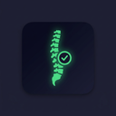

  

<h1 align="center">HealthOS Posture Monitor</h1>

  <strong>A privacy-focused, AI-powered desktop posture monitor that runs 100% locally.</strong>

  
  
  
  

---

## ⚡ Features

- **Offline Artificial Intelligence**: Uses MediaPipe and OpenCV directly on your machine. Absolutely zero data, images, or video leaves your computer.
- **Micro-Popups**: Automatically pops up over your work when you have been slouching for more than 60 seconds.
- **Smart Dismiss**: Automatically hides itself the moment you sit up straight!
- **Break Reminders**: Sends a desktop notification every 60 minutes to remind you to stretch.
- **Zero-Setup**: Built as a self-contained executable. No Python, Node, or GPU drivers required. Just download and run!

---

## 📥 Installation

HealthOS provides completely portable, self-contained releases for all major platforms.

[**Download the Latest Release Here**](../../releases/latest)

### 🪟 Windows Setup & SmartScreen Warning
1. Download either the `.msi` Installer or the standalone `.exe` (Portable).
2. **Important**: Because this app is built by an indie developer (unsigned), Windows Defender SmartScreen will show a blue warning screen saying *"Windows protected your PC"*.
3. This is completely normal for open-source apps without a $300 corporate certificate.
4. Click **"More Info"** -> **"Run Anyway"**.

### 🍏 macOS Setup
1. Download the `.dmg` or `.app.tar.gz` (Portable).
2. Drag the app into your `Applications` folder.
3. Because the app is not downloaded from the official Mac App Store, your Mac will warn you when opening it.
4. **Fix**: Right-Click (or Control+Click) on `HealthOS` in your Applications folder and click **Open**. Click "Open" again on the popup. You only need to do this once.

### 🐧 Linux Setup
1. Download the `.AppImage` or `.deb` file.
2. If using the AppImage, ensure you make it executable: `chmod +x HealthOS*.AppImage`.

---

## 🏗️ Architecture

HealthOS is built with a unique modern stack for high performance:
- **Tauri (Rust)**: Handles the lightweight native desktop shell, system tray, notifications, and autostart features.
- **SvelteKit**: Powers the blazing fast glassmorphic user interface.
- **Python Backend**: Computes posture angles in real-time via `mediapipe`.
- **PyInstaller Sidecar**: The entire Python environment is bundled into a single binary format and automatically driven by the Tauri Rust core via shell commands.
